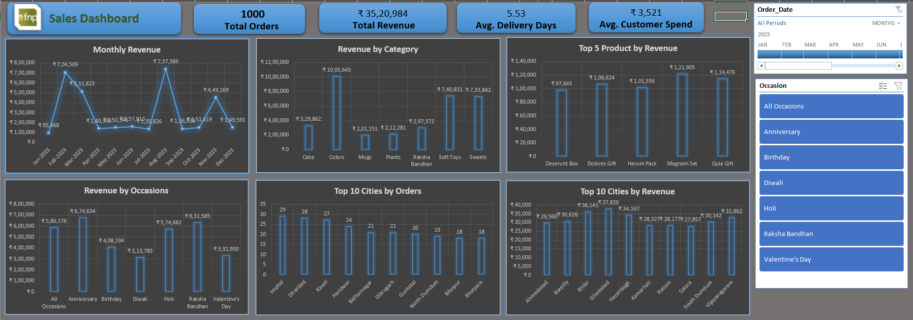

# Ferns & Petals (FNP) Sales Analysis Dashboard

## Project Overview

This project presents an interactive Excel Sales Analysis Dashboard developed for Ferns & Petals (FNP), a leading gifting company specializing in occasion-based gifting for events such as Diwali, Raksha Bandhan, Holi, Valentine's Day, Birthdays, and Anniversaries.

The dashboard analyzes sales transactions, customer behavior, product performance, and delivery metrics to provide actionable insights that support business growth and customer satisfaction.

---

## Business Problem

Ferns & Petals wanted to better understand sales patterns, customer purchasing behavior, product demand, and operational performance across different occasions and regions.

The objective was to transform raw sales data into meaningful business insights that would help management:

* Monitor revenue performance
* Improve customer experience
* Optimize product offerings
* Identify high-performing products
* Analyze delivery efficiency
* Support data-driven decision-making

---

## Solution

Developed a dynamic Excel Dashboard that provides a comprehensive view of sales and customer analytics through interactive visualizations and KPI tracking.

The dashboard enables stakeholders to quickly identify trends, compare performance across occasions, and uncover opportunities for business improvement.

---

## Key Business Questions Answered

### Revenue Analysis

* What is the total revenue generated?
* How does revenue vary across different occasions?

### Customer Analysis

* What is the average customer spending?
* Which cities generate the highest number of orders?

### Product Performance

* Which products generate the highest revenue?
* How do the top 5 products perform over time?
* Which products are most popular during specific occasions?

### Sales Trends

* How do sales fluctuate throughout 2023?
* Which months contribute the highest revenue?

### Operations & Delivery

* What is the average order-to-delivery time?
* Does order quantity impact delivery performance?

---

## Dashboard Features

### Executive KPIs

* Total Revenue
* Total Orders
* Average Customer Spending
* Average Delivery Time

### Sales Analysis

* Monthly Revenue Trends
* Occasion-wise Revenue Comparison
* Top Revenue-Generating Products
* Top 5 Product Performance

### Customer Insights

* Top 10 Cities by Orders
* Customer Spending Patterns

### Operational Insights

* Order Quantity vs Delivery Time Analysis
* Delivery Performance Monitoring

### Product Analytics

* Product Popularity by Occasion
* Revenue Contribution by Product

---

## Dashboard Screenshot



---

## Tools & Technologies

* Microsoft Excel
* Pivot Tables
* Pivot Charts
* Slicers
* Conditional Formatting
* Data Cleaning
* Dashboard Design
* Business Analysis

---

## Skills Demonstrated

* Excel Dashboard Development
* Data Analysis
* Data Visualization
* Sales Analytics
* Customer Analytics
* Business Intelligence
* KPI Reporting
* Data Cleaning
* Interactive Reporting
* Storytelling with Data

---

## Key Insights Generated

* Identified top-performing products contributing the highest revenue.
* Analyzed seasonal demand patterns across gifting occasions.
* Highlighted cities with the highest order volumes.
* Measured customer spending behavior and purchasing trends.
* Evaluated delivery performance and operational efficiency.
* Compared revenue performance across multiple occasions.

---

## Business Impact

The dashboard provides management with a centralized view of sales, customers, products, and operations. It enables faster decision-making, helps identify growth opportunities, improves product planning, and supports strategies to enhance customer satisfaction.

---

## Project Structure

```text
ferns-petals-sales-analysis-dashboard/
│
├── README.md
│
├── Screenshots/
│   └── FNP_Sales_Dashboard.png
│
├── Dataset/
    └── FNP_Sales_Data.xlsx

```

## Author

**Maninder Karda**

Senior Data Analyst | Power BI Developer | Excel Dashboard Specialist

Passionate about transforming raw data into actionable business insights through analytics, visualization, and storytelling.
